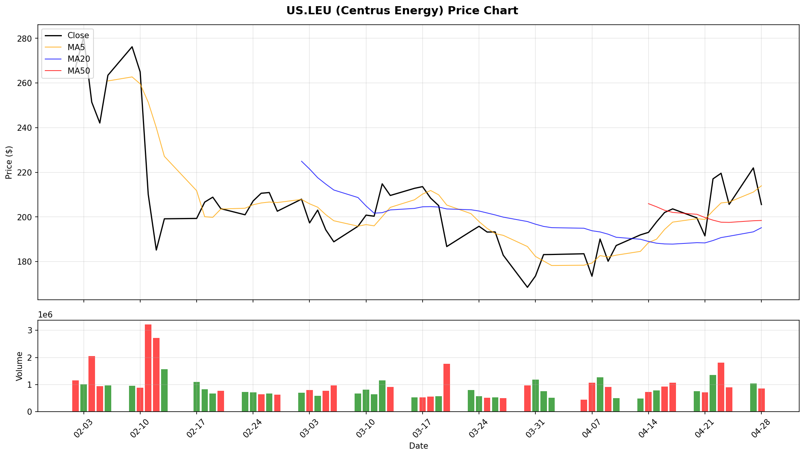
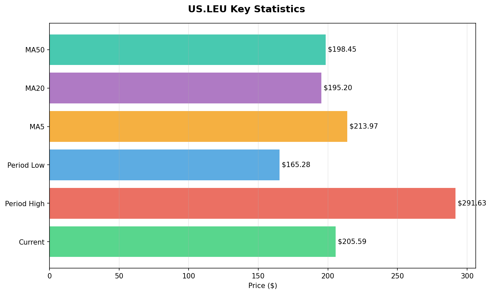

# Centrus Energy (LEU) 投研分析报告

> **分析日期**：2026年4月29日  
> **当前价格**：$205.59（盘中 $201.86 ~ $215.585）  
> **前收盘**：$221.98  
> **52周区间**：约 $70 ~ $300+  
> **分析类型**：Swing Trade 共振分析  
> **风格标签**：拐点 / 超级成长 / 政策驱动 / 大国重器

---

## 目录

1. [宏观方向](#一宏观方向)
2. [初筛验证](#二初筛验证)
3. [基本面深度分析](#三基本面深度分析)
4. [技术面精准分析](#四技术面精准分析)
5. [资金+情绪共振验证](#五资金情绪共振验证)
6. [交易计划建议](#六交易计划建议)
7. [持仓跟踪与风控](#七持仓跟踪与风控)
8. [综合结论](#八综合结论)

---

## 一、宏观方向

### 当前环境判断

| 维度 | 状态 |
|------|------|
| **核能周期** | 全球核电复兴进入政策执行期，美国本土核燃料自主可控成为国家战略 |
| **地缘政治/供应链** | 2028年俄罗斯铀进口禁令倒计时，美国浓缩铀产能缺口亟待填补 |
| **AI+核电叙事** | 数据中心用电需求爆发，"核电+AI"成为结构性需求增量 |
| **政策驱动** | 特朗普政府签署多份核能总统令，2050年目标400GW（当前~100GW） |

### 关键行业逻辑

> Centrus CEO Amir Vexler 原话："2025年是Centrus的里程碑之年，我们正式启动了离心机建设，并获得了政府9亿美元HALEU浓缩合同。我们在满足商业和国家安全市场需求的独特定位上，无人可比。"

**核心拐点叙事**：全球核电复苏叠加美国本土核燃料自主可控的战略紧迫性，Centrus 作为美国唯一具备HALEU（高丰度低浓缩铀）量产能力的本土企业，正处于从"合同签署"向"产能兑现"的关键拐点期。$3.8B的订单 backlog 为未来几年提供了高度可见的收入路径。

---

## 二、初筛验证

LEU 通过"超级成长+拐点+政策驱动"筛选器的验证：

| 筛选条件 | LEU 状态 | 验证结果 |
|---------|----------|---------|
| **成长性** | $3.8B backlog 延伸至2040；DOE $900M HALEU合同；离心机产能2029年上线 | ✅ 强烈通过 |
| **拐点信号** | 从纯贸易公司向自主产能建设转型；政府合同从"意向"进入"执行" | ✅ 强烈通过 |
| **政策驱动** | 美国唯一本土HALEU生产商；2028俄铀禁令；NNSA意向独家采购 | ✅ 强烈通过 |
| **趋势强度** | 过去一年从$70涨至$300+，当前回调至$205 | ⚠️ 中期趋势向上，短期深度回调 |
| **机构背书** | B. Riley/HCWainwright/Northland/Needham 等多机构给出Buy评级 | ✅ 通过 |

---

## 三、基本面深度分析

### 2025 全年及 Q4 财报核心数据

| 指标 | 2025全年 | 2024全年 | 同比变化 |
|------|---------|---------|---------|
| **总营收** | $448.7M | $442.0M | **+1.5%** |
| **毛利** | $117.5M | $111.5M | **+5%** |
| **毛利率** | ~26.2% | ~25.2% | +100bps |
| **净利润** | $77.8M | $73.2M | **+6.3%** |
| **基本EPS** | $4.33 | $4.49 | -3.6% |
| **稀释EPS** | $3.90 | $4.47 | -12.7% |
| ** unrestricted 现金** | $2.0B | — | 显著改善 |

### 分部门表现

| 部门 | 2025营收 | 同比 | 关键驱动 |
|------|---------|------|---------|
| **LEU（低浓缩铀）** | $346.2M | -1% | SWU销量+23%，但被铀收入-54%抵消 |
| **Technical Solutions** | $102.5M | +11% | HALEU运营合同收入增加$10.5M |

**关键财务细节**：
- SWU（分离功单位）收入同比+21%，销量+23%，是LEU部门的核心增长引擎
- 铀收入同比-54%，主要因2024年有一次性大额销售，不具备可比性
- Technical Solutions毛利率从2024年的19%大幅下滑至6%，主因HALEU合同成本超支且部分阶段未确定费用率

### 成长驱动力验证

1. **$900M DOE HALEU 合同**
   - 2026年1月获选，合同上限$9亿，履约期至2031年1月
   - 将 Piketon, Ohio 设施扩展至商业规模HALEU生产
   - 已签订建设合同，启动离心机制造

2. **$3.8B 总订单 backlog**
   - $2.3B contingent LEU 销售合同延伸至2040年
   - 为产能爬坡后的"第n套成本"目标提供销量保障

3. **NNSA 意向独家采购**
   - 国家核安全管理局意向将部分铀浓缩活动独家委托给Centrus
   - 进一步强化其"国家安全资产"定位

4. **国内离心机制造启动**
   - 2025年12月在 Oak Ridge, TN 启动制造
   - 预计2029年首批新浓缩产能上线

### 估值与分析师动态

| 机构 | 评级 | 目标价 | 备注 |
|------|------|--------|------|
| Needham | Buy | **$357** | 最高目标价 |
| B. Riley | Buy | **$295** | 近期从更高目标价下调 |
| H.C. Wainwright | Buy | **$300** | 维持 |
| Northland | Buy | **$285** | 维持 |
| Craig-Hallum | Buy | — | 维持 |
| J.P. Morgan | Hold | **$236** | 维持 |
| Citigroup | Neutral | **$225** | — |
| UBS | Hold | **$195** | 警告竞争压力 |
| Roth MKM | Hold | — | — |

**共识目标价约$287，较当前$205.59有约40%上行空间。**

### ⚠️ 基本面风险点

| 风险 | 说明 |
|------|------|
| **执行风险** | $900M合同及离心机产能建设规模庞大，能否按时按预算完成存疑 |
| **竞争压力** | UBS指出浓缩领域可能出现竞争加剧（如Urenco、Orano等全球巨头） |
| **Technical Solutions 毛利承压** | HALEU合同成本超支导致该部门毛利率从19%暴跌至6% |
| **铀收入波动** | 受一次性销售影响大，季度间收入波动剧烈 |
| **政府资金依赖** | 大量收入和合同依赖DOE/NNSA拨款，政策风险不可忽视 |
| **2028俄铀禁令** | 虽然长期利好本土产能，但短期可能造成供应链紧张和价格波动 |
| ** dilutive 融资风险** | 大规模资本开支可能需要额外融资，稀释现有股东 |

---

## 四、技术面精准分析

### 价格走势结构

从60日K线数据看，LEU 走出了**"急涨→剧烈震荡→深度回调"**的结构：

```
2月初:  $267 ~ $291  ← 阶段高点
2月中:  $185 ~ $210  ← 快速暴跌30%+
3月:    $180 ~ $220  ← 底部震荡/吸筹
4月中:  $190 ~ $230  ← 尝试反弹
4/27:   $221.98       ← 反弹至$224
4/28:   $205.59       ← 大跌7.4%，跌破多条均线
```

**近期走势**：股价在4月22日一度冲高至$230.49，但随后连续回调，4月28日大跌7.4%收于$205.59，跌破MA5/MA10/MA60。

### 技术指标信号

**时间范围：2026.2.2 - 2026.4.28（60个交易日）**

| 指标 | 数值/信号 | 解读 |
|------|----------|------|
| **当前价** | $205.59 | 处于近期震荡区间下沿 |
| **60日区间** | $165.28 ~ $291.63 | 波动幅度高达76% |
| **MA5** | $213.97 | 已跌破 |
| **MA20** | $195.20 | 尚在上方，构成短期支撑 |
| **MA50** | $198.45 | 尚在上方，构成中期支撑 |
| **60日涨跌幅** | -23.1% | 从2月初高点大幅回调 |
| **K线形态** | 4/28长阴线跌破MA5/MA10/MA60 | 短期空头占优 |
| **金叉信号** | MA10上穿MA60；MA20上穿MA30 | 中期均线仍在修复，存在矛盾信号 |

### 关键技术位

| 位置 | 价格 | 意义 |
|------|------|------|
| **短期阻力** | $213-$215 | MA5 + 4/28盘中高点 |
| **中期阻力** | $220-$230 | 前期反弹高点密集区 |
| **强阻力** | $250 | 期权大单行权价密集区 |
| **短期支撑** | $195-$200 | MA20/MA50交汇区 |
| **中期支撑** | $180-$185 | 4月初震荡平台上沿 |
| **强支撑** | $165 | 60日最低点 |





---

## 五、资金+情绪共振验证

### 期权市场（衍生品异动）

**时间范围：近30个自然日**

| 类型 | 关键合约 | 信号解读 |
|------|---------|---------|
| **买入看涨 Call** | 行权价$240-$250，到期日6/18及12/18 | 🟢 强烈看涨——大额资金押注股价回升至$240+ |
| **V/OI 比值** | 最高达10（4/8行权价$240合约） | 🟢 异常活跃，远超正常水平 |
| **大单金额** | 单笔涉资$61K-$204K | 🟢 机构级押注 |

**关键观察**：
- 4月8日出现多笔买入Call大单，集中在行权价$240，到期日2026/12/18
- 4月21日出现行权价$250的Call大单，到期日2026/06/18
- 所有异动均为**买入看涨期权**，显示期权市场资金在押注股价反弹

**衍生品综合判断**：期权市场呈现**强烈看涨**格局，大量Buy Call集中在$240-$250区间，与分析师共识目标价$287方向一致。但需注意这些合约期限较短（6月/12月），反映的是中短期反弹预期。

### 新闻情绪与催化

| 时间 | 新闻 | 情绪方向 |
|------|------|---------|
| 4/29 | Roth MKM 维持 Hold 评级 | 🟡 中性 |
| 4/28 | J.P. Morgan 维持 Hold，目标价$236 | 🟡 中性 |
| 4/24 | B. Riley 维持 Buy，下调目标价至$295 | 🟢 积极（虽下调但仍看40%+涨幅） |
| 4/22 | H.C. Wainwright 维持 Buy，目标价$300 | 🟢 积极 |
| 4/20 | SEC文件：建设合同上限$9亿，履约期至2031年 | 🟢 强烈积极 |
| 4/20 | Craig-Hallum 维持 Buy | 🟢 积极 |
| 近期 | 与KHNP/POSCO探索外资投资Ohio产能 | 🟢 积极 |

### 社区情绪

从富途社区及市场讨论看，LEU 近期关注度较高，投资者主要围绕以下话题：
- 核能政策利好（特朗普行政令、DOE合同）
- 股价从$300+回调后的抄底机会
- 2029年产能上线前的"预期博弈"
- 竞争对手（Urenco、Orano）对美国市场的潜在威胁

---

## 六、交易计划建议

### 当前状态评估

| 维度 | 评分 | 说明 |
|------|------|------|
| **基本面** | ⭐⭐⭐⭐☆ | 政策拐点明确，$3.8B backlog 提供强支撑，但执行风险和技术解决方案毛利压力需观察 |
| **技术面** | ⭐⭐☆☆☆ | 短期跌破多条均线，处于回调通道；但MA20/MA50尚未失守 |
| **资金面** | ⭐⭐⭐⭐☆ | 期权市场强烈看涨，机构目标价普遍在$285-$357 |
| **情绪面** | ⭐⭐⭐☆☆ | 政策面极度乐观，但股价回调导致短期情绪受挫 |
| **共振度** | ⭐⭐⭐☆☆ | 基本面长期向好+技术面短期恶化，处于"时间换空间"的震荡期 |

### 核心判断

> **LEU 是一个典型的"政策驱动+产能拐点"长期叙事标的，但短期处于"利好兑现前的震荡洗盘"阶段。股价从$300+回调至$205，跌幅约30%，已释放部分风险。最佳策略是在关键支撑位附近分批建仓，博弈中期反弹至分析师目标价区间。**

### 方案A：回调买入（推荐）

| 要素 | 内容 |
|------|------|
| **买入触发区** | $195 ~ $205（MA20/MA50支撑区 + 当前价附近） |
| **买入方式** | 分批建仓（$205买1/3，$195买1/3，$180买1/3） |
| **止损位** | $175（跌破60日最低点$165前的心理止损） |
| **第一目标位** | $240（期权密集行权价区） |
| **第二目标位** | $285-$300（分析师共识目标价区） |
| **持仓周期** | 4-12周 |
| **仓位建议** | 正常仓位（5-8%账户资金） |

### 方案B：突破追买（激进）

| 要素 | 内容 |
|------|------|
| **买入触发** | 若股价在$200上方整理3-5天后放量突破$220 |
| **止损位** | $190 |
| **目标位** | $250-$280 |
| **仓位建议** | 轻仓位（3-5%账户资金） |
| **风险** | 追高风险较大，止损空间较宽 |

### 关键观察清单（买入前必须确认）

- [ ] 股价是否在$195-$200支撑区企稳
- [ ] MA20是否上穿MA50形成多头排列
- [ ] 成交量是否在下跌过程中萎缩（缩量调整是健康信号）
- [ ] DOE $900M合同谈判是否有进一步进展
- [ ] Q1 2026财报（预计5月初发布）是否超预期
- [ ] 铀价是否维持在$80/磅以上

---

## 七、持仓跟踪与风控

### 如果已持仓

| 跟踪维度 | 观察指标 | 减仓/退出信号 |
|---------|---------|-------------|
| **技术面** | 20日/50日均线、成交量 | 放量跌破$180；MA20下穿MA50形成死叉 |
| **基本面** | 季度业绩、backlog变化、毛利率 | Q1营收<$110M；Technical Solutions毛利率<5% |
| **资金面** | 期权Put/Call比、大单流向 | Put买入激增；主力连续净流出 |
| **情绪面** | 新闻热度、分析师调级 | 目标价集体下调；出现"卖出"评级 |
| **宏观面** | 核能政策、铀价、美联储 | 特朗普核能政策逆转；铀价跌破$60/磅 |

### 具体退出触发器

| 触发条件 | 行动 |
|---------|------|
| 跌破$180且3日内无法收复 | 减仓50% |
| 跌破$165（60日最低点） | 清仓 |
| Q1财报营收低于$110M或出现亏损 | 减仓或清仓 |
| DOE合同谈判失败或被取消 | 清仓 |
| 达到$240-$250目标区 | 分批止盈（1/3、1/2、剩余设移动止损） |
| 达到$285-$300目标区 | 清仓或保留极小仓位跟踪长期叙事 |

---

## 八、综合结论

### 对于"拐点/超级成长/共振"风格的匹配度

1. **LEU 是一个典型的"政策拐点+产能扩张"长期标的**，在美国核燃料自主可控的战略叙事下，其作为唯一本土HALEU生产商的地位具有极高稀缺性。

2. **但当前不是最佳追涨点**——股价从$300+回调30%至$205，短期技术面偏弱，均线呈空头排列初期。更适合在$195-$205区间分批低吸，而非追高。

3. **最佳策略**：放入**观察清单**，设定$195-$205的买入警报，等待支撑位企稳后的二次确认。如果股价能在$200上方缩量整理并重新站上MA5，则是更安全的上车信号。

4. **如果急于参与**：只能用轻仓位（3-5%）在当前价位试探性建仓，严格设损$180。

### 一句话总结

> LEU 的"美国核燃料自主可控"故事正在从"政策预期"转向"合同执行和产能建设"，长期逻辑通顺且独一无二。但短期股价剧烈波动、技术面向下，建议在$195-$205支撑区分批布局，目标看向分析师共识区间$285-$300，止损严格设在$180下方。

---

*本报告基于公开信息整理，不构成投资建议。市场有风险，交易需谨慎。*

*Generated by Swing Trade Research Workflow*
