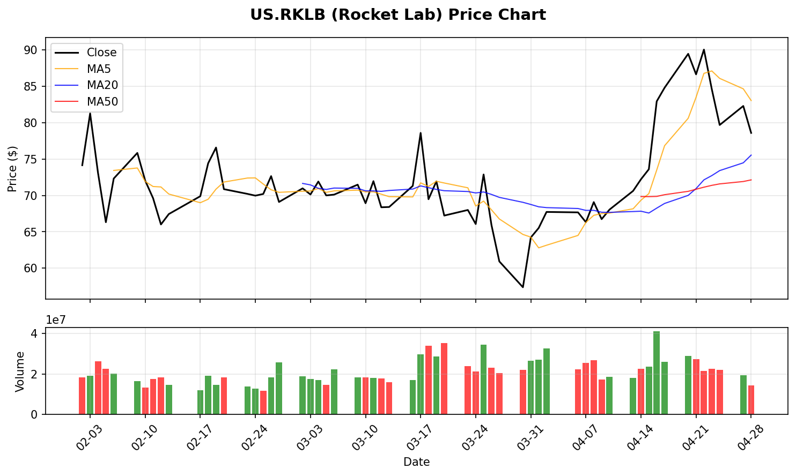
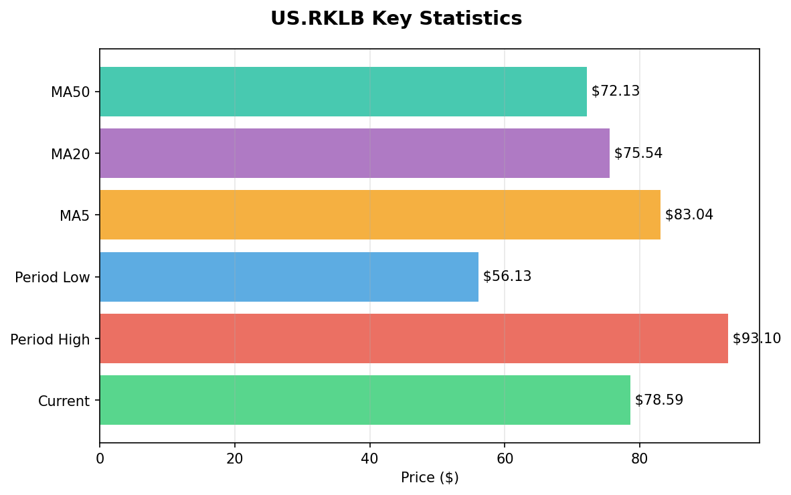

# Rocket Lab (RKLB) 投研分析报告

> **分析日期**：2026年4月29日  
> **当前价格**：$78.59（盘中 $77.60 ~ $81.78）  
> **前收盘**：$82.29  
> **52周区间**：约 $20.23 ~ $99.58  
> **分析类型**：Swing Trade 共振分析  
> **风格标签**：拐点 / 超级成长 / 政策驱动 / 太空经济

---

## 目录

1. [宏观方向](#一宏观方向)
2. [初筛验证](#二初筛验证)
3. [基本面深度分析](#三基本面深度分析)
4. [技术面精准分析](#四技术面精准分析)
5. [资金+情绪共振验证](#五资金情绪共振验证)
6. [交易计划建议](#六交易计划建议)
7. [持仓跟踪与风控](#七持仓跟踪与风控)
8. [综合结论](#八综合结论)

---

## 一、宏观方向

### 当前环境判断

| 维度 | 状态 |
|------|------|
| **太空经济周期** | 卫星互联网、SDA星座、商业发射需求爆发，进入超级周期 |
| **政策环境** | 美国太空军/SDA加速部署，国防预算向太空倾斜 |
| **竞争格局** | SpaceX主导大型发射，Rocket Lab在小型发射和太空系统领域建立壁垒 |
| **技术迭代** | Neutron中型火箭即将首飞，进入SpaceX核心市场 |

### 关键行业逻辑

> Rocket Lab CEO Peter Beck 的定位："我们要成为太空领域的端到端基础设施公司，不只是发射服务商。"

**核心拐点叙事**：Rocket Lab 正在从"小型发射服务商"向"端到端太空基础设施平台"转型。$1.85B backlog 中74%来自太空系统（卫星制造+组件），发射仅占26%。收购Mynaric（激光通信）和一系列垂直整合举措，使其成为除SpaceX外最完整的太空公司。Neutron火箭若成功首飞，将打开中型发射市场，直接挑战SpaceX的Falcon 9。

---

## 二、初筛验证

RKLB 通过"超级成长+拐点+政策驱动"筛选器的验证：

| 筛选条件 | RKLB 状态 | 验证结果 |
|---------|----------|---------|
| **成长性** | 2025营收$602M（+38% YoY）；backlog $1.85B（+73%） | ✅ 强烈通过 |
| **拐点信号** | 从单一发射向太空系统平台转型；毛利率从负转正趋势 | ✅ 通过 |
| **政策/国防** | $816M SDA Tranche III（公司史上最大合同）；累计SDA合同>$1.3B | ✅ 强烈通过 |
| **趋势强度** | 52周涨幅251%；MA20/MA50多头排列 | ✅ 通过 |
| **机构背书** | Stifel/Roth MKM上调目标价至$100-$105 | ✅ 通过 |

---

## 三、基本面深度分析

### 2025 全年及 Q4 财报核心数据

| 指标 | 2025全年 | 同比变化 | 说明 |
|------|---------|---------|------|
| **总营收** | $602M | **+38%** | 创公司纪录 |
| **Q4营收** | $180M | **+36%** | 连续高增长 |
| **Q4 GAAP毛利率** | 38% | 大幅改善 | non-GAAP 44.3% |
| **净利润(TTM)** | -$198M | 仍在亏损 | 但EBITDA亏损收窄 |
| **EPS(TTM)** | -$0.37 | — | Q4 EPS -$0.09 符合预期 |
| **现金** | $1.02B | — | 弹药充足 |
| **债务** | $265M | — | 债务率低（15.4% D/E） |

### 分业务表现

| 业务板块 | 占比 | 关键数据 | 驱动力 |
|---------|------|---------|--------|
| **太空系统** | ~74% backlog | $1.85B总backlog中占大头 | SDA卫星、组件、传感器 |
| **发射服务** | ~26% backlog | 2025年21次发射（纪录） | Electron小型火箭 |
| **Neutron（中型火箭）** | 尚未贡献收入 | 首飞推迟至Q4 2026 | 对标Falcon 9 |

### 成长驱动力验证

1. **$1.85B 创纪录 backlog**
   - 同比增长73%
   - 预计37%在未来12个月转化为收入
   - Space Systems占74%，发射占26%

2. **SDA 大单持续落地**
   - $816M SDA Tranche III（公司史上最大合同，18颗卫星）
   - 累计SDA合同超过$1.3B（Tranche II + III）
   - 政府收入提供高度可见性和利润率支撑

3. **发射业务龙头地位**
   - 2025年21次发射创公司纪录（Q4单季7次）
   - 小型发射市场绝对领导者
   - HASTE（高超声速测试）领域唯一可信供应商

4. **垂直整合战略**
   - 收购Mynaric（激光通信）—— 已关闭交易
   - 收购Geost、Optical Support、Precision Components
   - 自有高性能Star Tracker发布
   - 目标：降低供应链风险，提升毛利率

5. **Neutron 火箭——最大的期权**
   - 一级储箱测试破裂导致首飞推迟至Q4 2026
   - 已改用自动化纤维铺放（AFP）工艺
   - 若成功，将打开中型发射市场，直接竞争Falcon 9

### 估值与分析师动态

| 机构 | 评级 | 目标价 | 动作 |
|------|------|--------|------|
| Stifel | Buy | **$105** | 从$90上调 |
| Roth MKM | Buy | **$100** | 上调 |
| 共识（26位） | — | **$87.01** | 过去3个月上调22.9% |

**当前市值$46B vs TTM营收$602M = P/S约76x**，估值极高，反映了市场对其长期太空平台叙事的溢价定价。

### ⚠️ 基本面风险点

| 风险 | 说明 |
|------|------|
| **尚未盈利** | TTM净亏损-$198M，预计2027年才实现盈利 |
| **极高估值** | P/S 76x，任何执行失误都可能导致剧烈回调 |
| **Neutron推迟** | 首飞从2026年中推迟至Q4，进一步推迟风险存在 |
| **内部人减持** | 近期内部人士卖出$3100万股票；Cathie Wood/ARK持续减持 |
| **做空压力** | Short interest达3152万股（占流通5.49%），较上月激增47% |
| **竞争风险** | SpaceX在发射领域统治地位；其他小型发射商（Astra等）虽弱但存在 |
| **政府合同依赖** | SDA大单占比过高，政策变化或预算削减影响大 |
| **期权投机过热** | 极端活跃的期权交易可能放大短期波动 |

---

## 四、技术面精准分析

### 价格走势结构

从60日K线数据看，RKLB 走出了**"强势上涨→高位震荡→小幅回调"**的结构：

```
2月初:  $74 ~ $81  ← 震荡整理
2月中:  $63 ~ $75  ← 快速下探至$56附近（2月底）
3月:    $56 ~ $72  ← 底部反弹
4月初:  $72 ~ $82  ← 稳步攀升
4月中:  $82 ~ $93  ← 冲高至$93.10（4/16）
4/28:   $78.59      ← 从高点回调约15%
```

**近期走势**：4月16日冲高至$93.10后连续回调，4月28日大跌4.5%收于$78.59，跌破MA5/MA10，但在MA20上方获得支撑。

### 技术指标信号

**时间范围：2026.2.2 - 2026.4.28（60个交易日）**

| 指标 | 数值/信号 | 解读 |
|------|----------|------|
| **当前价** | $78.59 | 从$93高点回调15% |
| **60日区间** | $56.13 ~ $93.10 | 波动幅度66% |
| **MA5** | $83.04 | 已跌破 |
| **MA20** | $75.54 | 当前支撑位 |
| **MA50** | $72.13 | 中期支撑 |
| **60日涨跌幅** | +6.0% | 整体仍呈上升趋势 |
| **K线形态** | 4/28阴线跌破MA5/MA10 | 短期进入调整 |
| **死叉信号** | 4/28 MA5跌破MA10形成死叉 | 短期空头信号 |
| **多头排列** | 4/27 MA整体仍呈多头排列 | 中期趋势尚未破坏 |

### 关键技术位

| 位置 | 价格 | 意义 |
|------|------|------|
| **短期阻力** | $82-$83 | MA10 + 前收盘价区 |
| **中期阻力** | $90-$93 | 前期高点密集区 |
| **强阻力** | $100-$105 | 分析师目标价区 |
| **短期支撑** | $75-$76 | MA20附近 |
| **中期支撑** | $70-$72 | MA50 + 前期平台 |
| **强支撑** | $56-$60 | 60日最低点 + 巨量Put卖出行权价 |





---

## 五、资金+情绪共振验证

### 期权市场（衍生品异动）

**时间范围：近30个自然日**

期权市场呈现**极度活跃+复杂信号**的格局：

| 类型 | 关键合约 | 信号解读 |
|------|---------|---------|
| **买入看涨 Call** | 行权价$82/$85，5月初到期 | 🟢 短期看涨押注 |
| **买入看跌 Put** | 行权价$71/$85/$90，5月-6月到期 | 🔴 大量对冲/看跌押注 |
| **卖出看跌 Put** | 行权价$60/$65/$70，2026/2028到期 | 🟢 强烈看涨——机构愿意在更低价位接盘 |
| **卖出看涨 Call** | 行权价$85/$95，2026/2028到期 | 🟡 认为短期涨至此处有阻力 |

**关键观察**：
- **4/23 买入Put大单**：行权价$90，2000张，V/OI高达**48.9**，涉资$259万
- **4/8 卖出Call大单**：行权价$85，**21000张**，V/OI高达**92.9**，涉资$5376万
- **4/8 卖出Put大单**：行权价$60，21000张，涉资$4263万
- **4/11 卖出Put大单**：行权价$65，17000张，涉资$3952万

**衍生品综合判断**：期权市场呈现**强烈分歧+高波动预期**。巨额的Sell Put（$60-$65）显示长期资金在下方建立安全垫；巨额Sell Call（$85）和大量Buy Put显示机构在押注短期震荡或回调。这是一个典型的"高波动区间交易"格局。

### 新闻情绪与催化

| 时间 | 新闻 | 情绪方向 |
|------|------|---------|
| 4/28 | Cathie Wood减持RKLB，买入NTLA | 🔴 负面（明星基金经理减持） |
| 4/27 | 期权交易异常活跃：119K合约，928K未平仓 | 🟡 中性偏波动 |
| 4/22 | Backlog达$1.85B，"发射挤压"动能 | 🟢 积极 |
| 4/20 | 完成JAXA第二次专属发射 | 🟢 积极 |
| 4/17 | 发布高性能Star Tracker | 🟢 积极 |
| 4/16 |  insiders卖出$3100万股票 | 🔴 负面 |
| 近期 | Stifel上调目标价至$105；Roth MKM上调至$100 | 🟢 积极 |

### 社区情绪

从富途及市场讨论看，RKLB近期关注度极高：
- 看好派：聚焦$1.85B backlog、SDA大单、Neutron长期潜力
- 谨慎派：担忧$46B市值 vs $602M营收的估值泡沫、内部人减持、Neutron推迟
- 做空力量：short interest较上月激增47%，做空与多头博弈激烈

---

## 六、交易计划建议

### 当前状态评估

| 维度 | 评分 | 说明 |
|------|------|------|
| **基本面** | ⭐⭐⭐⭐☆ | 成长性极强，backlog创历史新高，但尚未盈利且估值极高 |
| **技术面** | ⭐⭐⭐☆☆ | 中期趋势向上，但短期跌破MA5/MA10形成死叉，进入调整 |
| **资金面** | ⭐⭐⭐☆☆ | 期权市场极度活跃，多空分歧巨大；内部人减持+做空增加 |
| **情绪面** | ⭐⭐⭐☆☆ | 机构上调目标价 vs 明星基金减持，情绪分化 |
| **共振度** | ⭐⭐⭐☆☆ | 基本面长期向好但短期技术面恶化+估值过高，适合回调布局 |

### 核心判断

> **RKLB 是太空经济最纯正的成长标的之一，$1.85B backlog和SDA大单提供了坚实的基本面支撑。但$46B市值对应$602M营收（P/S 76x）的估值意味着股价已经price in了大量乐观预期。短期从$93回调15%至$78，建议在关键支撑位附近分批建仓，博弈反弹至$90-$100区间。**

### 方案A：回调买入（推荐）

| 要素 | 内容 |
|------|------|
| **买入触发区** | $72 ~ $78（MA20/MA50支撑区 + 当前价附近） |
| **买入方式** | 分批建仓（$78买1/3，$75买1/3，$72买1/3） |
| **止损位** | $68（跌破MA50且无法收复） |
| **第一目标位** | $90（前期高点区） |
| **第二目标位** | $100-$105（分析师目标价区） |
| **持仓周期** | 4-8周 |
| **仓位建议** | 轻-正常仓位（3-5%账户资金），因估值高风险大 |

### 方案B：突破追买（激进）

| 要素 | 内容 |
|------|------|
| **买入触发** | 若股价在$78上方整理3-5天后放量突破$85 |
| **止损位** | $75 |
| **目标位** | $95-$100 |
| **仓位建议** | 极轻仓位（2-3%账户资金） |
| **风险** | 追高风险极大，上方有巨额Sell Call压力 |

### 关键观察清单（买入前必须确认）

- [ ] 股价是否在$72-$76支撑区企稳（MA20/MA50）
- [ ] 成交量是否在下跌过程中萎缩
- [ ] 5/7 Q1 2026财报预期（共识EPS -$0.08，营收$194.7M）
- [ ] Short interest是否停止激增
- [ ] Cathie Wood/ARK是否停止减持
- [ ]  Neutron项目是否有进一步推迟消息

---

## 七、持仓跟踪与风控

### 如果已持仓

| 跟踪维度 | 观察指标 | 减仓/退出信号 |
|---------|---------|-------------|
| **技术面** | 20日/50日均线、成交量 | 放量跌破$68；MA20下穿MA50 |
| **基本面** | 季度营收、backlog、毛利率 | Q1营收<$180M；backlog增长停滞 |
| **资金面** | 期权Put/Call比、short interest | Put买入激增；short interest突破10% |
| **情绪面** | 新闻热度、分析师调级 | 目标价集体下调；出现"卖出"评级 |
| **宏观面** | 太空预算、SDA拨款、Neutron进度 | SDA预算削减；Neutron再次推迟 |

### 具体退出触发器

| 触发条件 | 行动 |
|---------|------|
| 跌破$68且3日内无法收复 | 减仓50% |
| 跌破$60（强支撑+大量Put行权价） | 清仓 |
| Q1财报营收<$180M或EPS远低于-$0.08 | 减仓或清仓 |
| Neutron再次推迟至2027年 | 减仓 |
| short interest突破10% | 减仓 |
| 达到$95-$100目标区 | 分批止盈（1/3、1/2、剩余设移动止损） |

---

## 八、综合结论

### 对于"拐点/超级成长/共振"风格的匹配度

1. **RKLB 是一个典型的"超级成长+政策驱动"标的**，$1.85B backlog和SDA大单提供了罕见的收入可见性，太空系统业务正在将其从"发射公司"重塑为"太空平台"。

2. **但当前估值已经反映了太多乐观预期**——P/S 76x、$46B市值意味着任何执行失误都可能引发20%+的回调。从$93回调至$78仅是开始，还是提供了买入机会？取决于对风险承受能力的判断。

3. **最佳策略**：放入**观察清单**，在$72-$78区间分批低吸，严格止损$68。如果股价能在此处缩量企稳并重新站上MA5，则是 safer 的上车信号。

4. **如果急于参与**：只能用极轻仓位（2-3%）在当前价位试探，因为短期技术面偏弱（MA5死叉MA10）、做空压力增加、内部人减持。

### 一句话总结

> RKLB 的"端到端太空平台"叙事正在从愿景走向兑现，$1.85B backlog 和 SDA 大单提供了坚实的基本面底座，但$46B市值对应76x P/S的估值意味着容错率极低。建议在$72-$78支撑区分批布局，目标看$95-$105，止损$68，仓位控制在5%以内以应对高波动。

---

*本报告基于公开信息整理，不构成投资建议。市场有风险，交易需谨慎。*

*Generated by Swing Trade Research Workflow*
